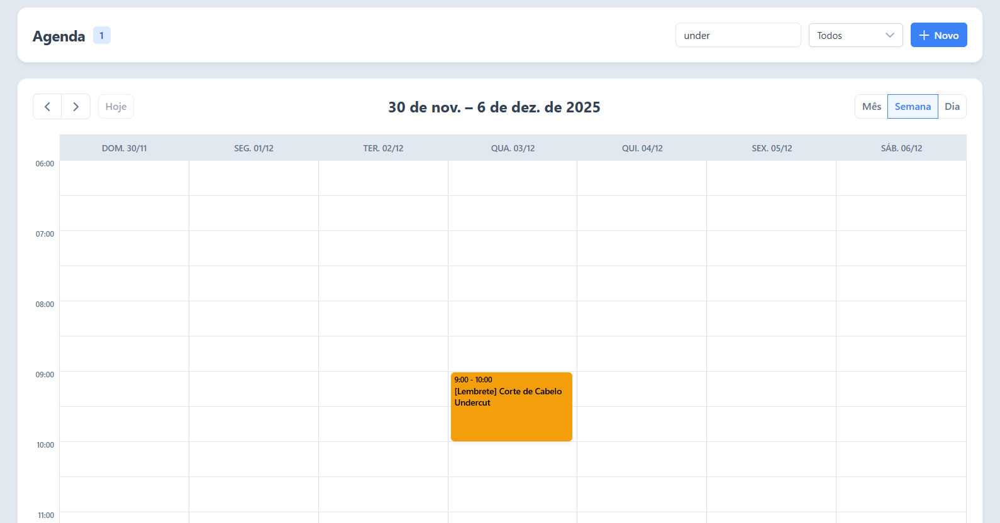

# 📅 Agenda App


## 🎯 Teste Prático para Desenvolvedor Front-End: Agenda de Compromissos
**Objetivo Central**: Construir uma aplicação de agenda funcional e bem estruturada com Angular
19 e PrimeNG para gerenciar compromissos.

🔍**Competências Avaliadas**:
1. Reatividade, Validações e Máscaras (Reactive Forms + PrimeNG)
2. Listagem e Controle de Estado
3. Componentização e Reuso
4. Integração com API (HTTP + interceptors)
5. Observabilidade e Feedbacks
6. Testes Automatizados
7. Controle de Estado Reativo com Signals

🧠**Resolução**: <p>Um sistema de agendamento de compromissos desenvolvido com as tecnologias mais recentes do ecossistema Angular. O projeto aplica boas práticas de arquitetura, Clean Code, princípios SOLID e inclui testes unitários com KarmaJS, além de testes End-to-End iniciais utilizando Cypress.</p>


## 📋 Pré-requisitos

* npm 
  ```sh
  npm install npm@latest -g
  ```

## 📦 Instalação

1. Clone o repositório

   ```sh
   git clone https://github.com/emanuelluiss/agenda-app
   ```

2. Abra a pasta onde o projeto foi clonado e instale os pacotes NPM

   ```sh
   npm install
   ```

## ▶️ Rode o projeto

* Comando Angular para rodar o projeto:
```sh
  ng serve
```

* Comando NPM para rodar o projeto definido no `package.json`:
```sh
  npm run start
```

## 🐳 Docker

- **Dockerfile:** O Manual de Construção — O segredo aqui é o conceito de Multi-Stage Build (Múltiplos Estágios). Usamos uma imagem pesada (Node.js) para construir o site e uma imagem leve (Nginx) apenas para servir o site.
- **Nginx Config:** O Gerente de Tráfego — Resolve o problema clássico de SPA: quando você atualiza a página em uma rota como ```/clientes```, o servidor procura um arquivo chamado "clientes". Como ele não existe, daria erro 404. Esta configuração corrige isso.
- **Docker Compose:** O Orquestrador — Este arquivo serve para "documentar a execução". Em vez de pedir para o desenvolvedor digitar um comando ```docker run``` gigante cheio de parâmetros, deixamos tudo configurado aqui.


### 🔄 Fluxo de Build e Deploy

| Etapa | Responsável | Descrição |
|-------|-------------|-----------|
| **1. Build** | Dockerfile (Node.js) | Lê o `package.json`, instala dependências e gera o build final em `dist/agenda-app/browser`. |
| **2. Setup** | Dockerfile (Nginx) | Remove o ambiente Node, prepara a imagem do Nginx e copia os arquivos HTML/JS gerados. |
| **3. Config** | nginx.conf | Garante o comportamento correto de SPA: rotas como `/login` sempre retornam `index.html`. |
| **4. Run** | Docker Compose | Sobe o container e expõe a porta `8080` do host para a porta `80` do container. |


### ▶️ Comandos Docker

Para iniciar a aplicação utilizando Docker e Docker Compose, siga os passos abaixo:

**🟢 Subir a aplicação**

O build será feito automaticamente e a porta 8080 será liberada.

```bash
docker compose up -d
```

**🛑 Parar a aplicação**

Encerra os containers e libera a memória.

```bash
docker compose down
```
<br>

> A aplicação estará disponível no endereço que configuramos no nosso arquivo `docker-compose.yml`: 👉 **http://localhost:8080/#/** 👈 
## 📸 Visualização


## 🚀 Funcionalidades

- **Visualização de Calendário:** Integração completa com FullCalendar.
- **Gestão de Compromissos:** Criar, editar e excluir agendamentos via Modal.
- **Validações Complexas:** Regras de negócio para horários, datas passadas e conflitos.
- **Mock Backend:** Interceptor HTTP que simula uma API REST, permitindo que o projeto rode 100% no navegador sem dependência de servidor externo.
- **Theming Avançado:** Sistema de cores e presets customizados do PrimeNG isolados na camada de Core.

## 🛠️ Tech Stack

* **Framework:** Angular 19 (Control Flow, Signals, Standalone Components)
* **UI Library:** PrimeNG 19 + PrimeIcons
* **Calendário:** FullCalendar 6
* **Testes E2E:** Cypress 15
* **Testes Unitários:** Jasmine/Karma
* **Arquitetura:** Modular orientada a Features (Feature-Based) com separação de camada de Domínio (Clean Architecture)


## 📂 Arquitetura do Projeto

O projeto segue uma estrutura modular focada em escalabilidade e manutenção, separando claramente as responsabilidades:

```text
src/app
├── core/                # Singletons e configurações globais
│   ├── interceptors/    # Mock Backend (Simulação de API)
│   ├── services/        # Serviços globais (Log, Notification)
│   └── themes/          # Definição de Presets visuais (SOLID/SRP)
├── domain/              # Camada de Domínio (Agnóstica de UI)
│   ├── dtos/            # Contratos de dados
│   └── models/          # Modelos de negócio
├── features/            # Funcionalidades do usuário
│   └── agenda/          # Módulo principal de Agendamento
└── shared/              # Componentes reutilizáveis
    ├── components/      # Ex: Modais de confirmação
    ├── constants/       # Ex: Constantes globais
    ├── directives/      # Ex: Máscaras de input
    └── validators/      # Validadores customizados de formulário
```


## 📌 Decisões Técnicas

* **Padrão Facade em Serviços:** <br>Seguir o Princípio Aberto/Fechado (OCP). Evita o acoplamento direto dos componentes com bibliotecas de terceiros (como PrimeNG) ou APIs do navegador (console). Isso protege a aplicação contra Vendor Lock-in, permitindo trocar a biblioteca de UI ou o sistema de logs no futuro sem refatorar centenas de arquivos.
* **Gerenciamento de Estado com Angular Signals:** <br>Separei sinais de escrita (`WritableSignal`) de sinais de leitura (`Signal`) para eliminar o "Prop Drilling" e garantir uma Fonte Única de Verdade (Single Source of Truth). O uso de `computed()` garante que estados derivados (como contadores de pendências) sejam matematicamente precisos e atualizados automaticamente, sem gerenciamento manual de variáveis.
* **Padrão Adapter na Integração de Dados:** <br>APIs trafegam JSON (Strings), mas o domínio da aplicação exige objetos `Date` reais para manipulação correta. O serviço intercepta e converte ("sanitiza") os dados antes que cheguem aos componentes. Da mesma forma, o componente de lista adapta o modelo de domínio para o formato específico exigido pela biblioteca `FullCalendar`, mantendo as camadas desacopladas.
* **Design Tokens e Herança de Tema:** <br>Ao invés de criar estilos do zero, utilizei a estratégia de Extensão de Tema (`definePreset`) sobre o tema "Aura" do PrimeNG, centralizando cores em arquivos de definição (`colors.ts` e `AgendaPreset`).
Motivo: Consistência cognitiva. O usuário aprende que mensagens de erro são persistentes (sticky) e sucessos são temporários. Além disso, impedir a digitação de caracteres inválidos é uma experiência de uso superior a exibir uma mensagem de erro após o fato.
* **Reactive Forms e Validação Cruzada:** <br>O componente `AgendaForm` utiliza a abordagem reativa (`FormBuilder`) com validações dinâmicas e cruzadas.<br>
Motivo: A obrigatoriedade do campo "Local" depende do "Tipo de Compromisso", e a "Data Final" não pode ser anterior à "Data Inicial". A abordagem reativa permite encapsular essa lógica de forma testável e robusta.
* **Tipagem Estrita e Convenções:** <br>Utilização de Union Types e Lookup Tables para tipos de dados críticos (`CommitmentType`, `COLORS_BY_TYPE`). em tempo de compilação. Isso impede estados inconsistentes (como um card sem cor definida) e erros de digitação, além de servir como documentação viva do código. A padronização do código em inglês evita a ambiguidade do "Portinglês".
* **Testes de Sinais, Isolamento e Efeitos:** <br>Nos testes unitários, utilizei estratégias de Spying (`spyOn`) e incluir uso de `provideHttpClientTesting` e `TestBed.flushEffects()`. Fazendo isso, garanto que os testes validem a lógica da unidade, não de suas dependências. Por exemplo, ao testar o `LogService`, verificamos se a cor correta foi passada para o console usando Regex Matching, sem sujar a saída do terminal. Além disso, valido não apenas o resultado final, mas o comportamento assíncrono e os efeitos colaterais (como persistência no `localStorage`) garantindo que a reatividade da aplicação funcione conforme o esperado.
* **Substituição do JSON-Server:** <br>Optei por substituir o JSON-Server por um Mock Interceptor Pattern para tornar a aplicação 100% autocontida.
Isso elimina a necessidade de processos Node.js externos e permite simular latência, erros e respostas personalizadas de forma totalmente programática.
* **Mock Backend como Scaffolding:** <br>Mock Backend atua como scaffolding, servindo apenas para viabilizar o desenvolvimento e testes locais.
Como não pertence ao domínio nem à lógica de produção, testá-lo seria redundante e não agregaria valor ao produto final — caracterizando meta-trabalho sem impacto real.
* **Encapsulamento de Lógica no Mock:** <br>Embora seja um scaffolding, o `MockBackendInterceptor` foi construído seguindo princípios de Clean Code, extraindo a lógica de cada verbo HTTP (GET, POST, DELETE) para métodos privados e utilizando RxJS `delay` para simular latência de rede.
* **Componentes PrimeNG Atualizados:** <br>p-calendar → date-picker, p-dropdown → select, essas mudanças refletem a evolução da biblioteca e maior aderência ao HTML semântico.
Para o campo Participantes (e-mails), optei por utilizar AutoComplete em modo múltiplo em vez de Chips. O componente Chips é orientado a elementos estáticos (tags, rótulos visuais, categorias). Para entrada dinâmica de dados — especialmente quando envolve validação de e-mails, sugestões, filtragem e UX interativa — o AutoComplete é a melhor opção.
* **Evolução do Two-Way Binding no Angular:** <br>Antes (Legacy Angular)
Era necessário implementar o padrão Banana-in-a-Box manualmente: (Ex: `@Input() visible!: boolean;`),<br> Hoje (Angular 17+) 
Utilizo a API model<boolean>(), que encapsula input, output e reatividade em uma única linha. (Ex: `public visible = model<boolean>(false);`)
* **Formulários e Validações (Evolução Angular):** <br>No `AgendaFormComponent`, adotei o modelo moderno de validações.<br>
**Antes** (Angular ≤14):
  Era comum criar diretivas personalizadas para validações.
  Necessário registrar em **NG_VALIDATORS**, o que gerava complexidade e baixo reaproveitamento.
  Testar validadores era mais trabalhoso.<br>
**Hoje** (Angular 15+):
  A recomendação é usar **ValidatorFn** standalone — funções puras, isoladas e reutilizáveis.
